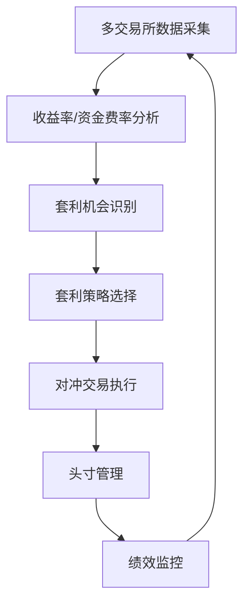

# Crypto High Yield Arbitrage System

一个自动化的加密货币高收益套利系统，专注于多交易所间的收益率套利和对冲交易，支持Binance、Bitget、Bybit、OKX和GateIO。

## 系统概述

本系统实现了跨交易所的高收益机会扫描和套利执行功能，主要特点包括：

- 多交易所支持 (Binance、Bitget、Bybit、OKX、GateIO)
- 活期理财产品收益率监控
- 理财产品收益率趋势分析
- 合约资金费率监控
- 资金费率趋势分析
- 高收益套利机会自动识别
- 对冲交易策略执行

## 系统架构

### 核心模块

1. **扫描与发现模块** (high_yield_scanner.py)
   - 交易所活期理财数据获取
   - 理财收益率趋势分析
   - 合约资金费率监控
   - 资金费率趋势分析
   - 套利机会识别与评分

2. **交易执行模块** (hedging_trade.py)
   - 对冲交易执行
   - 头寸管理
   - 交易状态跟踪

3. **交易所接口层** (exchange.py)
   - 统一交易所API
   - 订单管理
   - 市场数据获取

4. **资产管理模块**
   - 代币管理 (token_manager.py)
   - 用户管理 (user_manager.py)

5. **工具与辅助功能** (common.py)
   - 通用工具函数
   - 辅助方法

### 数据流



## 功能详情

### 已实现功能

1. **数据获取**
   - 多交易所活期理财产品数据
   - 理财产品收益率历史趋势
   - 合约资金费率实时数据
   - 资金费率历史趋势
   - 价格数据获取

2. **分析功能**
   - 收益率异常值检测
   - 理财收益率趋势分析
   - 资金费率趋势预测
   - 套利机会评分系统

3. **交易执行**
   - 对冲交易策略
   - 现货-合约套利
   - 多交易所间套利
   - 风险控制与头寸限制

4. **资产管理**
   - 代币白名单管理
   - 用户资产监控
   - 交易额度控制
   - 多用户支持

## 使用指南

### 环境要求
- Python 3.8+
- 依赖包：ccxt, pandas, numpy等 (详见requirements.txt [待创建])

### 配置方法
系统需要配置交易所API密钥和相关参数：

```python
exchange_configs = {
    "binance": {
        "api_key": "your_binance_api_key",
        "api_secret": "your_binance_api_secret"
    },
    "okx": {
        "api_key": "your_okx_api_key",
        "api_secret": "your_okx_api_secret",
        "password": "your_okx_password"
    },
    "bybit": {
        "api_key": "your_bybit_api_key",
        "api_secret": "your_bybit_api_secret"
    },
    "bitget": {
        "api_key": "your_bitget_api_key",
        "api_secret": "your_bitget_api_secret",
        "password": "your_bitget_password"
    },
    "gate": {
        "api_key": "your_gate_api_key",
        "api_secret": "your_gate_api_secret"
    }
}
```

### 启动方法
系统主入口为 high_yield_scanner.py，启动命令：

```bash
python scanner.py
```

## 待实现功能

### 1. 策略增强
- [ ] 动态调整的收益率阈值
- [ ] 更多维度的套利策略（如三角套利）
- [ ] 智能资金分配算法
- [ ] 套利路径优化

### 2. 风险控制
- [ ] 完整的止损机制
- [ ] 交易对流动性监控
- [ ] 价格波动保护
- [ ] 风险敞口限制

### 3. 系统优化
- [ ] 数据持久化存储
- [ ] 历史数据分析工具
- [ ] API请求队列优化
- [ ] 实时错误恢复机制

### 4. 监控与报告
- [ ] 实时监控面板
- [ ] 自动化报告生成
- [ ] 收益分析工具
- [ ] 通知警报系统

### 5. 回测系统
- [ ] 历史数据回测框架
- [ ] 策略参数优化
- [ ] 模拟交易环境

## 部署指南

[待完善部署步骤和配置说明]

## 开发计划

1. **近期目标**
   - 完善错误处理机制
   - 增加更多交易对支持
   - 优化资金分配算法

2. **中期目标**
   - 开发Web监控界面
   - 实现自动化资金调度
   - 增加更复杂的套利策略

3. **长期目标**
   - 分布式系统架构
   - 机器学习预测模型
   - 完整的回测与优化系统

## 贡献指南

[待添加开发规范和贡献流程]

## 许可证

[待添加许可证信息]
